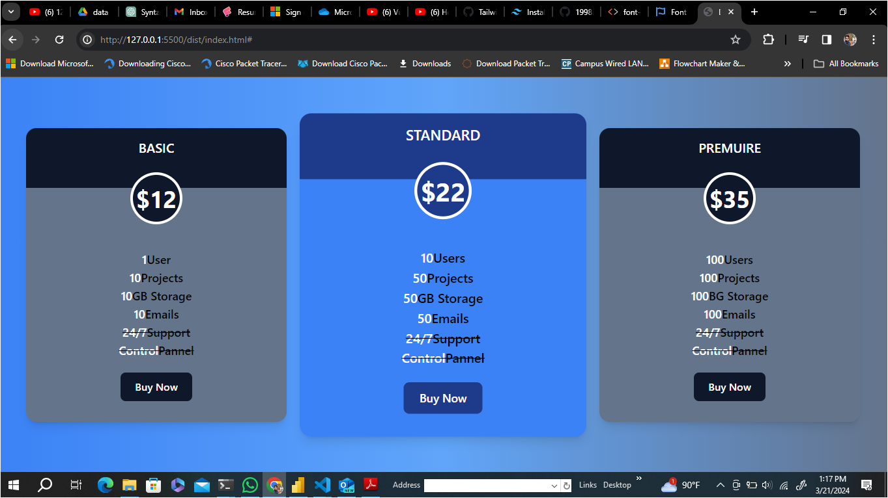

Simple Login Page With Tailwind CSS

Setup a Tailwind CSS project. 
Then, 
I will design a login page or a login form with Tailwind CSS classes. 
I have designed a login form by using Tailwind CSS (font awesome libraries)

Getting started

After cloning the repository, follow these command

Install Node Modules

npm install

Build & Complie Tailwind Command

npm run dev

Directory Info

The dist folder includes index.html & complied style.css
The src folder includes input.css which a Tailwind pre-compile file